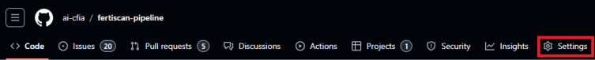

# GitHub Repository Creation Guide

([*Le français est disponible au bas de la
page*](#guide-de-création-de-dépôt-github))

When creating a GitHub repository you need to follow a few organizational
standardization rules :

- When naming your repository use lowercase. This makes it easier for command
  line use.
- Use a dash ( - ) and not an underscore ( _ ) to separate words in the
  repository name.
- Make the repository public.
- Add a description.
- Create a LICENSE.md file.
- Protect your branches.
- Enable secret scanning and push protection.

## How to Create a LICENSE.md File

1. Create a new file and name it `LICENSE.md` :
    - 

2. Click on "Choose a license template."
3. Choose "MIT License," and all the needed information will be filled in for
   you.
    - 

4. Click on "Review and submit" to create your file.

## Why You Need to Protect Your Branches

Protecting branches in GitHub is essential for maintaining code integrity,
ensuring a consistent commit history, and safeguarding against disruptive
changes. By mandating code reviews, preventing force pushes, and requiring
scrutiny of contributions, branch protection provides a foundational layer of
security and quality control in collaborative projects.

## How to Protect Your Branch

1. Go to your repository's main page.
2. Click on the "Settings" option on the top right.
    - 

3. Click on the "Branches" tab on the right menu.
    - 

4. Make sure to check "Require a pull request before merging," and also ensure
   that "Require approvals" is checked. You can leave the default option for the
   number of required approvals.
    - 

## How to Enable Secret Scanning and Push Protection

Enabling secret scanning and push protection in GitHub repositories helps
prevent sensitive information, such as API keys, passwords, and tokens, from
being inadvertently exposed in your codebase. Secret scanning detects exposed
secrets, while push protection actively blocks commits containing known secrets.
If a secret is leaked, repository administrators receive an alert.

To enable these functionalities:

1. From the main page of your repository, click **Settings**. 

1. In the sidebar, scroll down to the **Security** section and click **Code
   security**.

1. Scroll down to the **Secret scanning** section and click **Enable**. 

1. After enabling Secret scanning, the option to enable Push protection will
appear. Click **Enable**. 

---

## Guide de création de dépôt GitHub

Lors de la création d'un dépôt GitHub, vous devez suivre quelques règles de
standardisation organisationnelle :

- Utilisez des lettres minuscules pour nommer votre dépôt. Cela facilite son
  utilisation en ligne de commande.
- Utilisez un tiret ( - ) et non un soulignement ( _ ) pour séparer les mots
  dans le nom du dépôt.
- Rendez le dépôt public.
- Ajoutez une description.
- Créez un fichier `LICENSE.md`.
- Protégez vos branches.
- Activez la détection des secrets et la protection des poussées.

## Comment créer un fichier LICENSE.md

1. Créez un nouveau fichier et nommez-le `LICENSE.md` :
    - 

2. Cliquez sur "Choose a license template."
3. Sélectionnez "MIT License." Toutes les informations nécessaires seront
   remplies automatiquement.
    - 

4. Cliquez sur "Review and submit" pour créer votre fichier.

## Pourquoi protéger vos branches

Protéger les branches dans GitHub est essentiel pour maintenir l'intégrité du
code, garantir un historique de commits cohérent et prévenir les changements
disruptifs. En exigeant des revues de code, en empêchant les poussées forcées et
en requérant un examen minutieux des contributions, la protection des branches
offre une couche fondamentale de sécurité et de contrôle de qualité dans les
projets collaboratifs.

## Comment protéger votre branche

1. Accédez à la page principale de votre dépôt.
2. Cliquez sur l'option "Settings" en haut à droite.
    - 

3. Cliquez sur l'onglet "Branches" dans le menu de droite.
    - 

4. Assurez-vous de cocher "Require a pull request before merging" et vérifiez
   également que "Require approvals" est coché. Vous pouvez laisser l'option par
   défaut pour le nombre d'approbations requises.
    - 

## Comment activer la détection des secrets et Push Protection

Activer la détection des secrets et le *push protection* dans les dépôts GitHub
aide à éviter l'exposition accidentelle d'informations sensibles, telles que des
clés API, des mots de passe et des jetons, dans votre code. La détection des
secrets identifie les secrets exposés, tandis que le *push protection* bloque
activement les commits contenant des secrets connus. En cas de fuite d'un
secret, les administrateurs du dépôt reçoivent une alerte.

Pour activer ces fonctionnalités :

1. Depuis la page principale de votre dépôt, cliquez sur **Settings**.  
   

2. Dans la barre latérale, faites défiler jusqu'à la section **Security** et
   cliquez sur **Code security**.

3. Faites défiler jusqu'à la section **Secret scanning** et cliquez sur
   **Enable**.  
   

4. Après avoir activé la détection des secrets, l'option pour activer le *push
   protection* apparaîtra. Cliquez sur **Enable**.  
   
